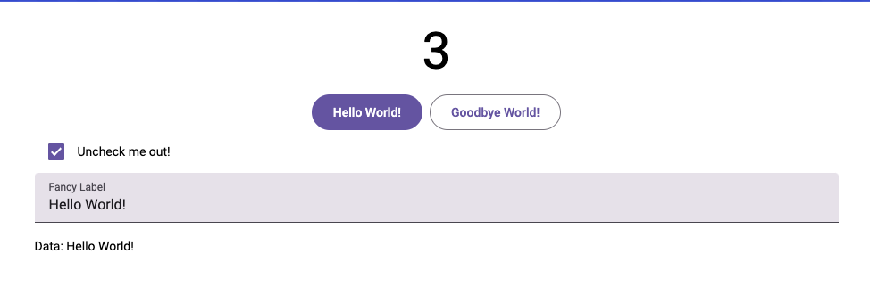

# WebGen + Material Web

This is a toy project to use Material Web Components with the WebGen Core API.

Currently there are only 3 Material Components implemented:

- Button
- Checkbox
- TextBox

## Demo

To run this demo just run `deno run -A serve.ts` and open your browser at <http://localhost:1337>
